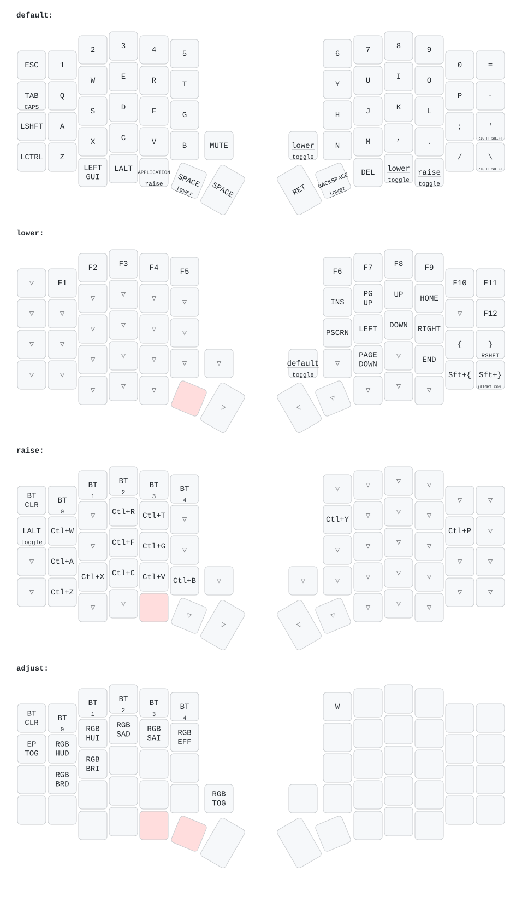

# Chú ý: Với các bạn đã Fork từ trước. Vào 2 mục sofle.conf và build.yaml copy paste vào repositories cũ của mình để mở chức năng zmk studio
# Thông tin mở rộng: các bạn có thể copy các dòng code rồi chat với chat GPT để hiệu chỉnh code đơn giản và paste lại xong commit, sẽ có nhiều phương án tối ưu dựa trên repos có sẵn, lưu ý rằng hãy nhồi nhét chức năng đủ dùng để hoạt động mượt mà với nhu cầu, đừng tham những chức năng không cần thiết, bàn phím sẽ đơ lag nếu những chức năng đó không hiệu quả

# Build firmware:
- Nhanh nhất: push lên GitHub, Actions tự build (xem .github/workflows/build.yml)
- Build local trên Windows không cần mạng: làm theo [docs/LOCAL_BUILD_SETUP.md](docs/LOCAL_BUILD_SETUP.md)
  (đã verify thành công trên máy thật — gồm cả script `scripts/build-zmk.sh` chạy 1 lệnh)

# ⚠️ Clone mới / fork phải biết (đọc [docs/LOCAL_BUILD_SETUP.md](docs/LOCAL_BUILD_SETUP.md) mục đầu):
- Repo KHÔNG chứa source ZMK/Zephyr (~2.5GB, west kéo về) và toolchain (~3GB)
- Bản mod có **9 file patch thẳng vào cây `zmk/`** (curve pin LiPo, mV qua split BLE...)
  → đã backup tại `patches/0001-*.patch`; sau mỗi `west update` PHẢI chạy
  `git -C zmk checkout local/sofle-patches` (hoặc `git -C zmk am ../patches/0001-*.patch`)
  nếu không % pin sẽ sai + build thiếu trường millivolts
- Thư mục `zmk/` trong repo là gitlink (SHA pointer) — clone về rỗng là BÌNH THƯỜNG,
  `west update` sẽ điền đúng source
- Hardware: OLED trái đã đổi 1.3" 128x64 **SH1106** xoay dọc 90° (stock 0.96" SSD1306)

# Dưới đây là sơ đồ cơ bản chức năng phím

